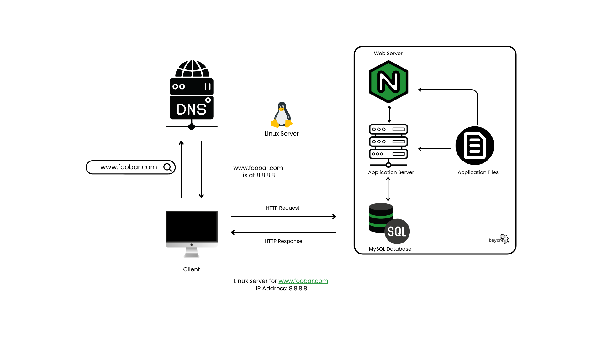

## 0.Simple Web Stack
A one server web infrastructure design that hosts a website that is reachable via www.foobar.com. This design consist of a server, Nginx web server, application server, code base (application files), database and a domain name configured to IP server: `8.8.8.8`.
    

## How It Works
The user enters the url www.foobar.com in the web browser search bar to the website. The browser uses a DNS query to discover the IP address for the given domain name. The entry www.foobar.com here is a `www` record that links to the IP address `8.8.8.8`.

**What is a server?** A server is a computer program or device that provides functionality for other programs or devices, called "clients". This architecture is called the client-server model. Servers can provide various functionalities, such as sharing data or resources among multiple clients, processing requests from clients, and managing network traffic.

**What is the role of the domain name?** The domain name was used to identify IP address `8.8.8.8`. it was also used in URL: www.foobar.com to identify web page. A domain name is a unique name that identifies a website. It is used to translate human-readable names into IP addresses that computers can understand.

**What type of DNS record www is in www.foobar.com?** The DNS record for "www" in "www.foobar.com" is called a CNAME record. It maps the subdomain "www" to the domain name "foobar.com". CNAME records are used to map one domain name to another.

**What is the role of the web server?** The web server stores, process and delivers web page (of www.foobar.com) to the client. A web server is a computer program that serves content, such as web pages, using the HTTP protocol over the internet or an intranet.

**What is the role of the application server?** It provides an environment where applications can run independently of each other while sharing common resources. It is a software framework that provides both facilities to create web applications and a server environment to run them.

**What is the role of the database?** It stores data related by common field or key in tables and provides a way to manage and manipulate the data. A database is an organized collection of data stored and accessed electronically.

**What is the server using to communicate with the computer of the user requesting the website?** The server uses HTTP (Hypertext Transfer Protocol) to communicate with the computer of the user requesting the website. HTTP is an application protocol for distributed, collaborative, hypermedia information systems.

## Issues with the Simple Web Stack Design
**SPOF Single Point of Failure**. This design is dependent on a single component, and if that component fails, the entire system will fail. SPOFs can be avoided by introducing redundancy in the system, such as backup servers or power supplies.

**Downtime when maintenance needed**. This design may have *Downtime*. This refers to the time when a website or application is unavailable due to maintenance activities such as deploying new code or restarting web servers. Downtime can be minimized by using techniques such as load balancing and rolling updates.

**Cannot scale if too much incoming traffic**. This design finds it difficult to handle an increase in traffic beyond its capacity. This can be addressed by scaling the system horizontally (adding more servers) or vertically (adding more resources to existing servers) and using techniques such as load balancing and caching.
