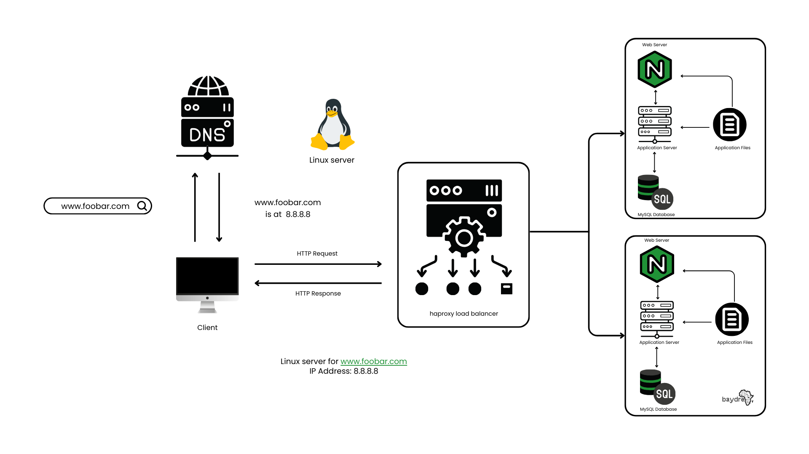

## 1.Distributed Web Infrastructure
A three server web infrastructure that hosts the website www.foobar.com. This consist of 2 servers, Nginx web server, application server, HAproxy load-balancer, code base (application files) and a database.
    

## How It Works

In the [Simple Web Stack](https://github.com/baydre/alx-system_engineering-devops/blob/master/0x09-web_infrastructure_design/concepts/0-simple_web_stack.md) Infrastructure, The basics of how to host a website reachable via www.foobar.com with the help of DNS (Domain Name System) was explained. Here, HAproxy load balancer was included. The load balancer increases application availability and dependability by distributing incoming traffic among several servers.
This is set up with a Round Robin algorithm, which evenly distributes incoming requests among available servers.
In an active-active configuration, both servers are running and responding to requests simultaneously. Instead, in an Active-Passive configuration, one server would be active while the other would be passive and would only take over in the event that the active server failed.

**What distribution algorithm your load balancer is configured with and how it works?** The distribution algorithm used is configured a Round Robin algorithm, which evenly distributes incoming requests among available servers. In a least connections algorithm, requests are sent to the server with the fewest active connections. In an IP hash algorithm, requests are distributed based on the client's IP address. Other common algorithms include **least connections**

**Is your load-balancer enabling an Active-Active or Active-Passive setup, explain the difference between both?** The Active-Passive setup was preferred to the Active-Active setup in enabling the load-balancer. An active-active setup refers to a configuration where multiple servers are actively processing requests at the same time. In an active-passive setup, one server is actively processing requests while the other server(s) are on standby in case of failure. The primary difference between the two setups is that active-active provides better performance and scalability, while active-passive provides better reliability and fault tolerance.

**How a database Primary-Replica (Master-Slave) cluster works?** A primary-replica (master-slave) database cluster consists of one primary node and one or more replica nodes. The primary node is responsible for processing write operations and replicating data to the replica nodes. The replica nodes are responsible for processing read operations and maintaining a copy of the data stored on the primary node. When a write operation is performed on the primary node, it is replicated to all of the replica nodes to ensure data consistency.

**What is the difference between the Primary node and the Replica node in regard to the application?** The primary node in a database cluster is responsible for processing write operations, while replica nodes are responsible for processing read operations. This means that applications that require high write throughput will benefit from using a primary node, while applications that require high read throughput will benefit from using replica nodes.

## Issues with the Distributed Web Infrastructure Design
**SPOF Single Point of Failure**. This design has multiple SPOFs (load balancer and main-node database), if load balancer or database from the main node fails, the entire system will fail. SPOFs can be avoided by introducing redundancy in the system, such as backup servers or power supplies.

**Security Concerns (no firewall, no HTTPS)**. This design is exposed to unauthorised access due to lack of firewall in it. Due to absence of HTTPS, sensitive information such as login credentials, credit cards numbers, etc, can be intercepted by third parties.

**Monitoring**. This design finds it difficult to recognise issues. Without monitoring tools the infrastructure is unable collect, process and visualise data in real-time to provide insights about the web services perfomance.