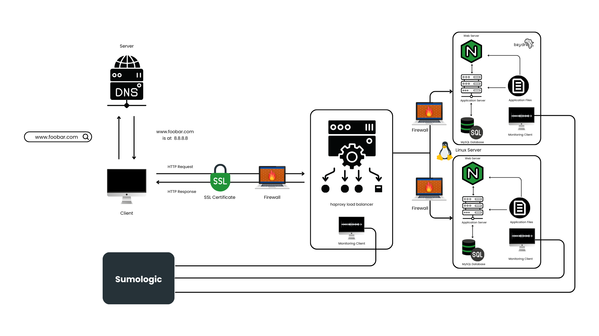

## 2.Secured and Monitored Web Infrastructure
A three server web infrastructure that hosts the website www.foobar.com, it must be secured, serve encrypted traffic, and be monitored.    
## How It Works
In this design a secure HTTP (HTTPS) connection with an SSL Certificate, firewalls and monitoring services were added to [Distributed Web Infrastructure](https://github.com/baydre/alx-system_engineering-devops/blob/master/0x09-web_infrastructure_design/concepts/1-distributed_web_infrastructure.md). The goal is to ensure that the infrastructure is secured with encrypted traffic and data are collected.    **Firewalls** are network security systems that monitor and control incoming and outgoing network traffic based on predetermined security rules. They act as a barrier between the internal network and the internet, preventing unauthorized access to the network while allowing legitimate traffic to pass through.

**SSL certificates** are digital certificates that establish a secure connection between a web server and a browser. They encrypt the data transmitted between the two, ensuring that sensitive information such as login credentials, credit card numbers, etc., cannot be intercepted by third parties.

**Monitoring clients** are software agents that monitor the performance and availability of web applications and services. They collect data on various metrics such as response time, uptime, error rates, etc., and alert system administrators in case of any anomalies or issues.
